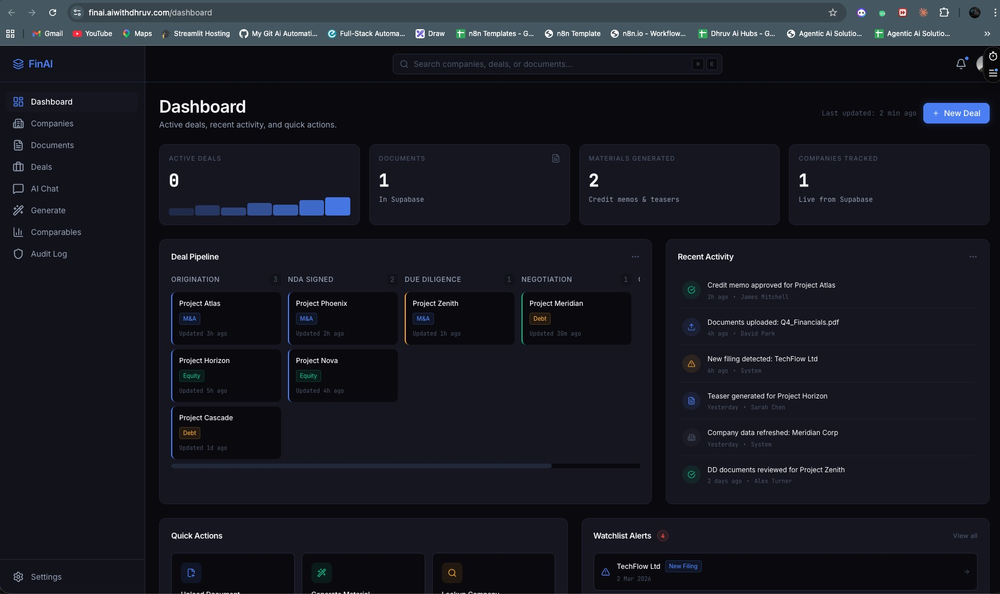

# FinAI -- Financial Document Intelligence System

**AI-powered operating system for UK financial advisory firms. Upload documents, ask questions, generate credit memos and deal teasers -- all with source-traced, hallucination-resistant AI.**

Built by [AiwithDhruv](https://aiwithdhruv.com) | **Live Demo:** [finai.aiwithdhruv.com](https://finai.aiwithdhruv.com)

---

## What is FinAI?

FinAI is a full-stack document intelligence platform purpose-built for financial advisory. It combines RAG (Retrieval Augmented Generation), deterministic financial calculations, and multi-model AI to automate the most time-consuming parts of deal execution -- document analysis, credit memo drafting, and comparable company benchmarking.

The system enforces a critical principle: **financial ratios are calculated by code (Python Decimal math), never by LLMs**. The AI generates narrative sections only, with every claim traced back to source documents.

## Features

- **Document Ingestion** -- Upload PDFs (annual reports, financial statements). AI parses, chunks with financial-context awareness, embeds via pgvector, and classifies document type automatically.
- **RAG Chat** -- Ask questions about uploaded documents. Get answers with source citations, page numbers, confidence scores, and relevance badges.
- **Credit Memo Generation** -- Auto-generate credit memorandums with LLM narrative + code-calculated financial ratios. Human review gate before approval.
- **Deal Teaser Generation** -- Create anonymized (Project Apollo-style) or named deal teasers for M&A, debt advisory, and equity mandates.
- **Company Intelligence** -- Search UK companies via Companies House API. View 5-year financials, officers, filings, and risk indicators.
- **Comparable Analysis** -- Sector benchmarking with EV/EBITDA, EV/Revenue, Net Debt/EBITDA across 10+ UK companies with median calculations.
- **Deal Pipeline** -- Kanban board tracking deals through Origination → NDA → Due Diligence → Negotiation → Closed stages.
- **Audit Log** -- Immutable activity trail. Every user action, AI generation, and document access logged with timestamps and IP addresses.
- **Multi-Model Support** -- Swap between Claude Sonnet 4.6, Grok 4.1 Fast, and Kimi K2.5 via a single environment variable.

## Architecture

```
┌─────────────────────────────────────────────────────────┐
│                    Next.js Frontend                      │
│  Dashboard │ Chat │ Companies │ Docs │ Deals │ Generate  │
└──────────────────────┬──────────────────────────────────┘
                       │ REST API
┌──────────────────────▼──────────────────────────────────┐
│                   FastAPI Backend                         │
│                                                          │
│  ┌─────────┐  ┌──────────────┐  ┌────────────────────┐  │
│  │ Routes  │→ │  Services    │→ │  Repositories      │  │
│  │ (thin)  │  │  (logic)     │  │  (DB access)       │  │
│  └─────────┘  └──────────────┘  └────────────────────┘  │
│                                                          │
│  ┌──────────────────────────────────────────────────┐   │
│  │              AI Pipelines                         │   │
│  │                                                   │   │
│  │  Ingestion:  PDF → Chunk → Embed → pgvector      │   │
│  │  RAG:        Query → Retrieve → Rerank → Answer   │   │
│  │  Generation: Ratios (code) + Narrative (LLM)      │   │
│  └──────────────────────────────────────────────────┘   │
└──────────────────────┬──────────────────────────────────┘
                       │
┌──────────────────────▼──────────────────────────────────┐
│  PostgreSQL + pgvector  │  Companies House API  │  FRED  │
└─────────────────────────────────────────────────────────┘
```

**Key Design Decisions:**
- **3-layer backend** -- Routes (HTTP only) → Services (business logic) → Repositories (DB queries)
- **Deterministic financials** -- All ratio calculations use Python `Decimal` math, never LLM output
- **Source attribution** -- Every AI-generated claim cites document name + page number
- **Human review gate** -- No generated material marked "approved" without human sign-off
- **Financial-context chunking** -- Respects section headers, tables, and fiscal year boundaries

## Tech Stack

| Layer | Technology |
|-------|-----------|
| **Frontend** | Next.js 16, TypeScript, Tailwind CSS v4, Turbopack |
| **Backend** | FastAPI, Python 3.12, async SQLAlchemy 2.0, Pydantic v2 |
| **Database** | PostgreSQL + pgvector (Vector 1536), HNSW indexing |
| **AI Models** | Claude Sonnet 4.6 (default), Grok 4.1 Fast, Kimi K2.5 |
| **Embeddings** | OpenAI text-embedding-3-small (1536 dims) |
| **Data Sources** | Companies House API, yfinance, FRED |
| **Observability** | structlog (JSON), LangSmith tracing |
| **Deployment** | Docker Compose, Vercel (frontend), Render (backend) |

## Quick Start

### Prerequisites

- Python 3.12+
- Node.js 20+
- PostgreSQL with pgvector extension
- API keys (see `.env.example`)

### 1. Clone the repo

```bash
git clone https://github.com/aiagentwithdhruv/finai.git
cd finai
```

### 2. Start with Docker Compose (recommended)

```bash
docker compose up -d
```

This starts PostgreSQL with pgvector on port 5432. The database is ready with all required extensions (`pgvector`, `uuid-ossp`, `pg_trgm`).

### 3. Set up the backend

```bash
cd backend
cp .env.example .env
# Edit .env with your API keys (see Environment Variables below)

python -m venv venv
source venv/bin/activate
pip install -r requirements.txt
uvicorn app.main:app --reload --port 8000
```

Backend runs on `http://localhost:8000`. Health check: `GET /api/v1/health`

### 4. Set up the frontend

```bash
cd frontend
npm install
npm run dev
```

Frontend runs on `http://localhost:3000`.

### 5. Open and use

1. Open `http://localhost:3000`
2. Explore the dashboard, companies, deals, and documents
3. Upload a PDF to test the ingestion pipeline
4. Ask questions in AI Chat to test RAG retrieval
5. Generate a credit memo or deal teaser

## Environment Variables

Copy `backend/.env.example` to `backend/.env` and configure:

### Required

| Variable | Description |
|----------|-------------|
| `DATABASE_URL` | PostgreSQL connection string (`postgresql+asyncpg://...`) |
| `ANTHROPIC_API_KEY` | Anthropic API key for Claude models |
| `OPENAI_API_KEY` | OpenAI API key for embeddings |
| `SUPABASE_URL` | Supabase project URL |
| `SUPABASE_ANON_KEY` | Supabase anon key |
| `SUPABASE_SERVICE_KEY` | Supabase service role key |
| `COMPANIES_HOUSE_API_KEY` | UK Companies House API (free -- [register here](https://developer.company-information.service.gov.uk/)) |
| `FRED_API_KEY` | FRED API key (free -- [register here](https://fred.stlouisfed.org/docs/api/api_key.html)) |

### Model Selection (optional -- defaults shown)

```bash
# Swap the primary LLM with one env var:
LLM_MODEL=claude-sonnet-4-6              # Anthropic  | $3/$15 per M tokens  | 200K context
# LLM_MODEL=grok-4-1-fast-reasoning      # xAI        | $0.20/$0.50 per M    | 2M context
# LLM_MODEL=kimi-k2.5                    # Moonshot   | $0.60/$3.00 per M    | 256K context

CLASSIFIER_MODEL=claude-haiku-4-5-20251001
EMBEDDING_MODEL=text-embedding-3-small
LLM_TEMPERATURE=0.2
```

### Optional

| Variable | Description |
|----------|-------------|
| `XAI_API_KEY` | xAI API key (for Grok models) |
| `MOONSHOT_API_KEY` | Moonshot API key (for Kimi models) |
| `LANGSMITH_API_KEY` | LangSmith tracing (recommended for production) |
| `ALPHA_VANTAGE_API_KEY` | Alpha Vantage (yfinance used as primary) |

## Project Structure

```
finai/
├── backend/
│   ├── app/
│   │   ├── api/routes/          # 8 route modules (health, companies, documents, deals, rag, generation, comparables, audit)
│   │   ├── core/                # config.py (validated settings), database.py, logging.py
│   │   ├── models/              # 9 SQLAlchemy models (Company, Financial, Document, Chunk, Deal, Material, Comparable, Audit)
│   │   ├── schemas/             # 10 Pydantic v2 request/response schemas
│   │   ├── repositories/        # 7 async repos with pgvector cosine search
│   │   ├── services/            # Business logic layer
│   │   ├── pipelines/
│   │   │   ├── ingestion/       # pdf_parser → chunker → embedder → classifier → pipeline
│   │   │   ├── rag/             # retriever (hybrid search) → chat (Claude)
│   │   │   └── generation/      # ratios.py (Decimal math) + credit_memo.py + teaser.py
│   │   └── main.py              # FastAPI app factory with lifespan, CORS, request tracing
│   ├── migrations/              # Alembic database migrations
│   ├── tests/                   # pytest test suite
│   ├── Dockerfile               # Python 3.12-slim
│   ├── requirements.txt
│   └── .env.example
├── frontend/
│   ├── src/
│   │   ├── app/                 # 13 Next.js routes (App Router)
│   │   ├── components/          # Sidebar, Header, Badge, DataTable, MetricCard, AppShell
│   │   ├── lib/                 # API client with typed methods
│   │   └── types/               # TypeScript interfaces
│   ├── Dockerfile               # Multi-stage Node 20-alpine
│   ├── package.json
│   └── tsconfig.json
├── docker-compose.yml           # PostgreSQL + pgvector
└── CLAUDE.md                    # AI coding rules for this project
```

## API Endpoints

| Method | Path | Description |
|--------|------|-------------|
| `GET` | `/api/v1/health` | Health check with DB and service status |
| `GET` | `/api/v1/companies` | Search companies (Companies House + local) |
| `GET` | `/api/v1/companies/{id}` | Company detail with financials |
| `POST` | `/api/v1/documents/upload` | Upload and ingest PDF |
| `GET` | `/api/v1/documents` | List documents with status |
| `POST` | `/api/v1/rag/chat` | RAG chat with source citations |
| `POST` | `/api/v1/generation/credit-memo` | Generate credit memorandum |
| `POST` | `/api/v1/generation/teaser` | Generate deal teaser |
| `GET` | `/api/v1/deals` | List deals with pipeline stage |
| `GET` | `/api/v1/comparables` | Comparable company data |
| `GET` | `/api/v1/audit` | Audit log with filters |

## Screenshots



*Dashboard — Deal pipeline, company metrics, document stats, and quick actions at a glance.*

## How It Works

### Document Ingestion Pipeline
1. **Upload** -- PDF received via multipart upload
2. **Parse** -- Extract text with page boundaries and table detection
3. **Chunk** -- Financial-context-aware splitting (respects section headers, tables, fiscal years)
4. **Embed** -- Batch embed via OpenAI text-embedding-3-small (1536 dims)
5. **Classify** -- Claude Haiku classifies document type (annual report, interim results, prospectus, etc.)
6. **Index** -- Store chunks + vectors in pgvector with HNSW index for fast retrieval

### RAG Chat
1. **Query** -- User asks a financial question
2. **Retrieve** -- Hybrid search: pgvector cosine similarity + keyword matching
3. **Rerank** -- Score and filter by relevance threshold
4. **Generate** -- Claude Sonnet synthesizes answer with mandatory source citations
5. **Validate** -- Confidence scoring (high/medium/low) based on retrieval quality

### Credit Memo Generation
1. **Ratios** -- Pure Python Decimal math calculates EBITDA margin, leverage, coverage, growth
2. **Tables** -- Financial summary tables built from code (never LLM)
3. **Narrative** -- Claude generates borrower profile, risk assessment, recommendation
4. **Assembly** -- Code-calculated tables + LLM narrative = complete credit memo
5. **Review** -- Human approval gate before distribution

## Contributing

1. Fork the repo
2. Create a feature branch (`git checkout -b feature/amazing-feature`)
3. Commit changes (`git commit -m 'Add amazing feature'`)
4. Push to the branch (`git push origin feature/amazing-feature`)
5. Open a Pull Request

## License

MIT License -- see [LICENSE](LICENSE) for details.

---

**Built with Claude Code** | [AiwithDhruv](https://aiwithdhruv.com) | [GitHub](https://github.com/aiagentwithdhruv)
